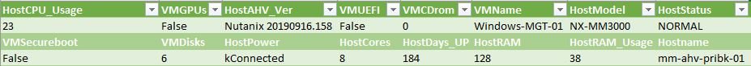
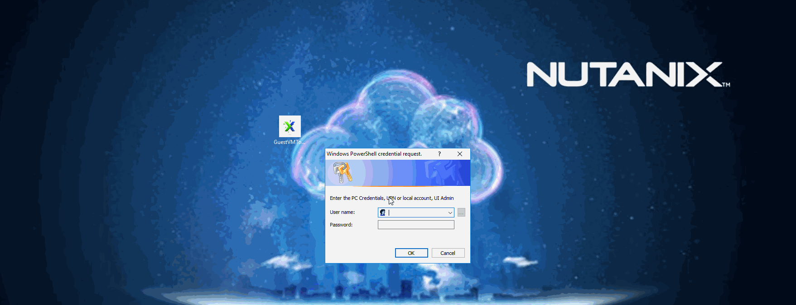
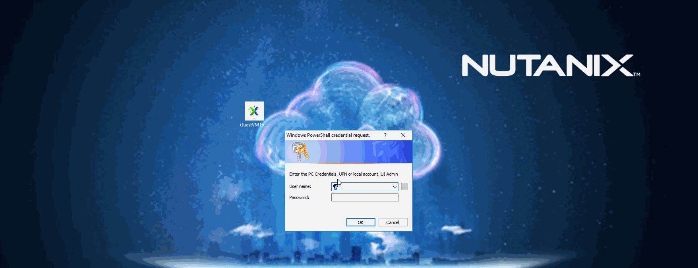
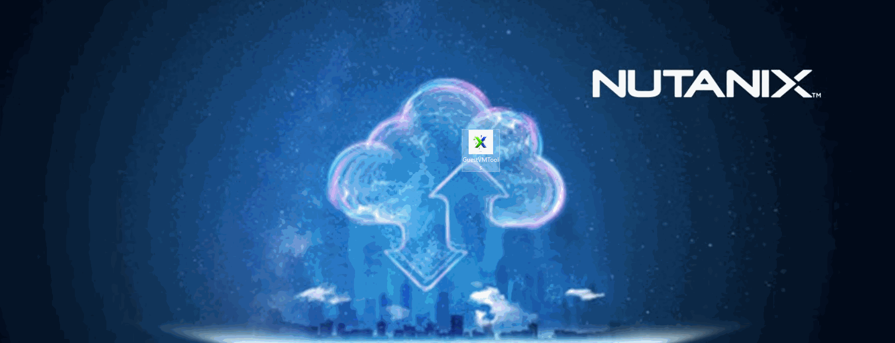

# Nutanix Guest VM Tools
API based Powershell for in-guest tools.
Compiled as a single executable for 1-click Experience.
Please note, this is not official Nutanix software, use at your own risk.

##Current Version 1.0.0.0##

**Requirements**
- Windows Machine with PowerShell 5
- Prism Central Credentials, Local or Directory Based, no SSH access required.
- AOS 5.16 or above for Secure Boot.
- PC / AOS on 5.9 or above for API V3
- a mouse, lol, this tool is designed for UI usage. (powershell also works but still sends UI diaglogs.)

**Capabilties**
- **Report** Reports the VM Details, on which host its running and host performance.
- **Add-Ram** Only adding Memory is supported regardless of power state.
- **Add-Disk** Adds a disk to the local or targeted VM.
- **Extend-Disk** Extends a disk to the local or targeted VM.
- **Enable-SecureBoot** Remote Targets only, Poweroff required.
- **Snapshot-Create** Creates a snapshot of the local or targeted VM
- **Set-VM-Description** Sets the VM Description of the local or targeted VM
- **Mount-ISO** Mounts an ISO from the PE image store on which the VM is hosted.
- **Mount-NGT** Mounts an NGT of the local or targeted VM

- **How to use** There are 2 methods to run:
	1. **Executeable** Use the compiled exe from this github repo, copy and click.
	2. **Run GuestVMTools.ps1** Please make sure the pwd is changed to the repo before you launch

# Detailed User Info #

**Report**

Gets the PE host that this VM belongs too, this only works if the VM is powered on! Using host & VM info it builds a response table.
Once generated an option is provided for outputting as CSV.

**Add-Ram**

Addition only, adds memory to the running or targeted VM, nothing more.
Confirms the change by prompting the new value, 
 if this value is the same your Nutanix cluster cannot assing more.

**Add-Disk**

Addition only, adds a disk to the running or targeted VM, nothing more.
Prompts for a target container to store the disk.
Confirms the change by checking the prism task result.
Currently SCSI Disks are the only supported disks.

**Extend-Disk**

Prompts the user for the disks mounted to the target VM.
Currently SCSI Disks are the only supported disks.
Prompts the user for the new disk size.
Confirms the change by checking the prism task result.

**Enable-SecureBoot**

Since AOS 5.16 Secureboot is supported, however CLI or API only, there is no UI button yet.
This tool allows to enable secureboot on any VM, Poweroff, Change IDE drives etc.
All operations that are required for secure boot.
Prompts the user several times depending on Power and Present Drives.
IDE Disks cannot be handled, IDE CDrom drives (multiple) are replaced on user approval.
Confirms the task by retrieving the secureboot value.
Works only on targeted VMs, not on local duh.

**Snapshot-Create**

Creates a Prism Element Based Snapshot. 
Prompts the user for the description.

**End result**

# Detailed Code Info #

Will be added on 1.1 release